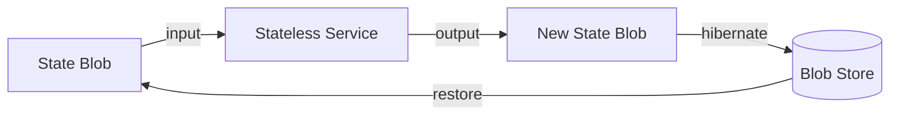

<!--
  Stateless Architecture — the formal specification and reference
  implementation of the core loop. The north star for every repo in the
  stateless-engineering org.
-->

<div align="center">
  <p><em>The formal specification, pattern language, and reference<br>implementation of the stateless core loop.</em></p>
</div>

---

## What This Repository Is

`stateless-architecture` is the **contract**. It defines *exactly* how state, services, and progressive restoration interact — language-agnostic, rigorous, and testable.

Where [`stateless-engineering`](https://github.com/stateless-engineering/stateless-engineering) is the Node.js monorepo and [`stateless-platform`](https://github.com/stateless-engineering/stateless-platform) is the production browser/runtime, this repo is the **document that says "this is how it must work"** — the north star every other repo conforms to.

| Aspect | `stateless-architecture` | `stateless-engineering` | `stateless-platform` |
|--------|--------------------------|--------------------------|----------------------|
| **Role** | Spec + reference impl | Node.js monorepo | Production runtime |
| **Audience** | Engineers, standards bodies, researchers | Contributors to the org | End users, integrators |
| **Content** | Formal state machine, schemas, protocol, pseudocode, Rust core | Webshell, benchmarks, tooling, docs | Full browser shell, OS integration |
| **Dependencies** | None (self-contained ideas) | Node ≥ 18, zero deps | Implements these specs |
| **Deliverable** | A crate that proves the core loop works | Working services + benchmarks | A usable product |

---

## The Core Loop

Everything in this repository radiates from one idea:

> **A system is a state blob + a service invocation. State is truth; the engine is a pure function of (blob, inputs) → (new blob, outputs).**



The three operations every stateless system must support:

1. **Snapshot** — serialize the entire system to a blob.
2. **Render** — pass the blob through a stateless service to produce output.
3. **Restore** — materialize a system from a blob, progressively.

---

## Repository Structure

```
stateless-architecture/
├── README.md                    # This file
├── LICENSE                      # MIT
├── book/                        # mdBook source — the Pattern Language
│   ├── SUMMARY.md               # Table of contents
│   ├── 01-introduction.md       # The problem and vision
│   ├── 02-core-principles.md    # The one-sentence model, formalized
│   ├── 03-state-blob.md         # Schema, versioning, sealing
│   ├── 04-service-bus.md        # Service contract and discovery
│   ├── 05-progressive-restore.md # The restoration ladder
│   ├── 06-mesh-sync.md          # Peer-to-peer state sync
│   ├── 07-security-model.md     # The blob as a secure boundary
│   ├── 08-modularity-and-moddability.md # Swappable services
│   └── 09-applications.md       # Browsers, games, AI, mesh
├── spec/                        # Formal specifications
│   ├── state-blob.schema.json   # JSON Schema for the state blob
│   ├── service-bus.proto        # Protobuf service contract
│   ├── lifecycle.fsm            # Lifecycle state machine (PlantUML)
│   └── progressive-restore.md   # Timing requirements + sequence diagrams
├── reference/                   # Minimal reference implementation (Rust)
│   ├── Cargo.toml
│   └── src/
│       ├── lib.rs               # Public API
│       ├── state_blob.rs        # Core data structure + serde
│       ├── service_bus.rs       # Service trait + registry
│       ├── lifecycle.rs         # State machine transitions
│       ├── progressive.rs       # Four-pass restore
│       └── mesh.rs              # Sync protocol stub
├── rfcs/                        # Design proposals
│   └── 0001-webshell-lifecycle.md
├── tools/                       # Schema validators, diagram generators
└── .github/                     # CI, issue templates
```

---

## Quick Start

### Read the book

```bash
cd book
mdBook build    # or: mdbook serve for live preview
```

### Build the reference implementation

```bash
cd reference
cargo build
cargo test      # 40 tests: blob, service, lifecycle, progressive, mesh
```

### Validate schemas

```bash
cd spec
ajv compile -s state-blob.schema.json
```

---

## The Pattern Language

The `book/` directory is the **pattern language** — each chapter is one concept:

| Chapter | Question it answers |
|---------|---------------------|
| [01 – Introduction](book/01-introduction.md) | What problem does this solve? |
| [02 – Core Principles](book/02-core-principles.md) | What is the one-sentence model? |
| [03 – State Blob](book/03-state-blob.md) | What is a state blob, formally? |
| [04 – Service Bus](book/04-service-bus.md) | How are services defined, discovered, and wired? |
| [05 – Progressive Restore](book/05-progressive-restore.md) | How does a system come back from a blob? |
| [06 – Mesh Sync](book/06-mesh-sync.md) | How do peers synchronize state? |
| [07 – Security Model](book/07-security-model.md) | How is the blob a security boundary? |
| [08 – Modularity & Moddability](book/08-modularity-and-moddability.md) | How does stateless enable modding? |
| [09 – Applications](book/09-applications.md) | What can you build with this? |

---

## Formal Specifications

The `spec/` directory contains the machine-readable contracts:

| File | Format | Purpose |
|------|--------|---------|
| `state-blob.schema.json` | JSON Schema (draft-2020-12) | Validates state blobs |
| `service-bus.proto` | Protocol Buffers 3 | Service invocation and mesh sync protocol |
| `lifecycle.fsm` | PlantUML | Visual state machine for the system lifecycle |
| `progressive-restore.md` | Markdown + Mermaid | Timing requirements and restoration sequence |

---

## Conformance

A system **conforms** to this architecture when it:

1. Serializes to a blob matching `spec/state-blob.schema.json`.
2. Exposes services matching `spec/service-bus.proto`.
3. Follows the lifecycle in `spec/lifecycle.fsm`.
4. Restores progressively per `spec/progressive-restore.md`.
5. Is deterministic: same blob + same inputs → same output.

The reference implementation's test suite is the **conformance gate**.

---

## Relationship to the Org

```
stateless-architecture (this repo — the contract)
        │
        ├── stateless-engineering (Node.js monorepo — implements the contract)
        │       ├── packages/webshell/     ← service runtime
        │       ├── packages/bench-runner/ ← conformance measurement
        │       └── packages/benchmarks/   ← acceptance gates
        │
        └── stateless-platform (production runtime — conforms to the contract)
                ├── browser shell
                └── OS integration
```

If you want to write a new renderer, sync layer, or service — start here.

---

## License

MIT. Ideas should spread freely.

<div align="center">
  <br>
  <p><strong>Stateless Architecture</strong> — because the boundary between state and engine is the most important interface in software.</p>
</div>
