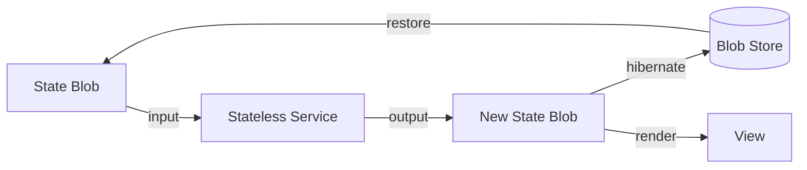

# Chapter 1 — Introduction

> A system is a state blob + a service invocation. State is truth; the engine is a pure function of (blob, inputs) → (new blob, outputs).

## 1.1 The Problem

Modern software welds state to its engine. A cache, a connection pool, a UI
tree — each holds implicit state never serialized as a unit. Evicting such a
system loses that state; restarting rebuilds it from logs and side effects.
Scaling demands sticky sessions and full environments; security, an enormous
surface.

## 1.2 The Vision

Stateless engineering makes the boundary between state and engine a first-class
interface. State is explicit, inspectable, versionable — a single serializable
object any engine can consume and produce; the engine is a pure function —
disposable, replaceable, verifiable — a discipline with invariants, a pattern
language, and a conformance gate.

## 1.3 The One-Line Model

> **A system is a state blob + a service invocation.**

Everything in this book unpacks that sentence. [Chapter 2 — Core
Principles](02-core-principles.md) defines it formally; the rest builds the
machinery around it.

## 1.4 The Core Loop


```rust
// The core loop: (blob, input) → (new_blob, output)
let session = accept_connection();                // 1. connect
let blob: StateBlob = restore(&store, &session);  // 2. restore prior state
let input: Input = receive();                     // 3. take an input
let (new_blob, output) = service(blob, input);    // 4. pure, deterministic
snapshot(&store, &new_blob);                      // 5. persist new state
reply(output);                                    // 6. emit output
```

Three operations: **Snapshot**, **Render**, **Restore**.

## 1.5 Pseudocode

```pseudocode
function render(blob: StateBlob, input: Input): (StateBlob, Output) {
    const (newBlob, output) = Service(blob, input)  // deterministic
    Snapshot(newBlob)
    return (newBlob, output)
}
```

## 1.6 This Repository

`stateless-architecture` is the **contract**: formal specification, pattern
language, and reference implementation. The `book/` directory is the pattern
language — each chapter one concept, self-contained. The schemas and Rust/WASM
core prove the loop works; the core's test suite is the **conformance gate**
every repo runs against itself.

## 1.7 Relationship to the Org

- **stateless-engineering** — the Node.js monorepo implementing the contract:
  webshell, benchmarks, tooling.
- **stateless-platform** — the production browser/runtime conforming to it.

To write a new renderer, sync layer, or service, start here.

## 1.8 How This Book Is Organized

The table of contents ([SUMMARY.md](SUMMARY.md)) maps the book.
[Chapter 2 — Core Principles](02-core-principles.md) formalizes the model;
[Chapter 3 — State Blob](03-state-blob.md) defines the blob;
[Chapter 4 — Service Bus](04-service-bus.md) the wiring;
[Chapter 5 — Progressive Restore](05-progressive-restore.md) coming back;
[Chapter 6 — Mesh Sync](06-mesh-sync.md) peer state;
[Chapter 7 — Security Model](07-security-model.md) the boundary;
[Chapter 8 — Modularity & Moddability](08-modularity-and-moddability.md) modding;
[Chapter 9 — Applications](09-applications.md) deployment. Each is
self-contained and cross-references its neighbors.
