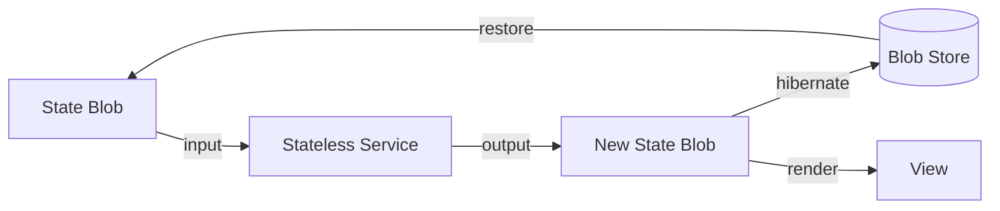

# Chapter 1 — The Core Principle

> **A system is a state blob + a service invocation. State is truth; the engine is a pure function of (blob, inputs) → (new blob, outputs).**

---

## 1.1 The One-Sentence Model

A **state blob** is a complete, serializable snapshot of everything the system knows. A **stateless service** is a pure function that transforms inputs against that blob. The **engine** applies the service and produces a new blob. Everything else — caches, connections, views — is a throwaway projection, rebuildable from the blob.

## 1.2 Why This Decomposition Matters

In a traditional system, state and engine are welded together. A cache, a connection pool, a UI tree — each holds implicit state never serialized as a unit. Evicting such a system loses that state; restarting rebuilds it from logs and side effects. The stateless model inverts this: the blob is the **only** source of truth, and the engine can be discarded at any time.

- **Eviction is lossless** — serialize, destroy, restore.
- **Restart is instant** — no warm-up, no replay log.
- **Scaling is trivial** — any engine instance serves any blob.
- **Testing is deterministic** — same blob + input, same result.

## 1.3 Formal Definition

A **stateless system** is a triple **(Blob, Service, Render)**:

- **Blob** ∈ `StateBlob` — the complete system state at a point in time.
- **Service** : `(StateBlob, Input) → (StateBlob, Output)` — a pure transformation.
- **Render** : `StateBlob → View` — a deterministic projection.

## 1.4 The Three Invariants

**Invariant 1 — Blob is the only source of truth.** No engine instance may hold state not in the blob.

**Invariant 2 — Services are pure functions.** `Service(blob, input)` is deterministic and side-effect-free — no environment, clock, or external reads. External data is fetched before invocation and passed as input, or applied afterwards.

**Invariant 3 — Render is deterministic.** `Render(blob)` yields identical output for identical input: no randomness, no clock reads.
```rust
/// A stateless service: pure (blob, input) → (blob, output).
trait Service {
    type Blob;
    type Input;
    type Output;

    fn apply(&self, blob: Self::Blob, input: Self::Input) -> (Self::Blob, Self::Output);
}

/// Example: a pure counter that bumps its tally by the input.
struct CounterService;
impl Service for CounterService {
    type Blob = u64;
    type Input = u64;
    type Output = ();

    fn apply(&self, blob: u64, input: u64) -> (u64, ()) { (blob + input, ()) }
}
```

## 1.5 The Core Loop



Three operations: **Snapshot** (serialize to a blob), **Render** (pass the blob through a stateless service), **Restore** (materialize from a blob, progressively). This loop is the only thing that crosses the eviction boundary.

## 1.6 Pseudocode

```pseudocode
function render(blob: StateBlob, input: Input): (StateBlob, Output) {
    const (newBlob, output) = Service(blob, input)  // pure
    Snapshot(newBlob)                                // hibernate
    return (newBlob, output)
}

function restore(serialized: Blob): StateBlob {
    return Deserialize(serialized)                   // progressive, ch. 4
}
```

## 1.7 The Inversion

Traditional systems keep state **inside** the engine — implicit, scattered, hard to serialize:

```
Traditional:  Engine[state] → Output
Stateless:    Blob → Engine → New Blob
```

State outside the engine means the engine can be destroyed and rebuilt without loss; state is explicit, inspectable, versionable.

## 1.8 Stateful vs. Stateless

| Dimension | Stateful | Stateless |
|-----------|----------|-----------|
| Memory | Implicit, scattered | Explicit, in the blob |
| Restore | Rebuild from logs | Load the blob |
| Security | Engine is the surface | Blob is the boundary |
| Modularity | Tightly coupled | Engine replaceable |
| Scaling | Sticky sessions | Any instance, any blob |
| Eviction | Lossy | Lossless |

## 1.9 How This Chapter Relates to the Rest of the Book

- **Chapter 3 — State Blob**: schema and serialization.
- **Chapter 4 — Service Bus**: definition, discovery, wiring.
- **Chapter 5 — Progressive Restore**: coming back from a blob.
- **Chapter 6 — Mesh Sync**: eviction and resurrection.
- **Chapter 7 — Security Model**: the blob as a boundary.
- **Chapter 2 — Core Principles (Determinism)**: bit-stable replay.
- **Chapter 6 — Mesh Sync**: peer state synchronization.
