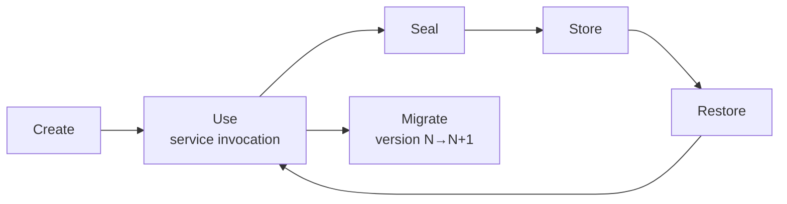

# Chapter 3 — The State Blob

> A system is a state blob + a service invocation. State is truth; the engine
> is a pure function of (blob, inputs) → (new blob, outputs).
>
> — Chapter 1 — Introduction

The **state blob** is the single source of truth in a stateless system — the
only structure that crosses the eviction boundary. Everything else is a
throwaway projection.

## 3.1 Prior Art

The state blob draws from decades of prior work:

- **Solid Pods** ([solidproject.org](https://solidproject.org)) use RDF triples
  with content-addressed URIs for decentralized storage. We adopt their
  content-addressing and schema validation (SHACL) but use a tree-structured
  document instead of flat triples — better for serialization size and
  random access.

- **Redux / Elm Architecture** pioneered the single immutable state tree with
  pure reducers: `(state, action) -> state`. Every transition is replayable,
  enabling time-travel debugging. We adopt serializable operations and the
  action journal, but generalize beyond application-specific actions to a
  generic operation envelope (`insert`, `delete`, `update`, `move`).

- **Web App Manifest** provides a declarative metadata envelope for installable
  apps. We adopt its approach of bundling metadata (name, icons, capabilities)
  alongside state, but extend it to carry the full state payload.

- **JSON-LD / Schema.org** add semantic context via `$schema` and typed data.
  We adopt schema-based validation and linked references between blobs, using
  schema.org vocabulary for common types (Person, Document, Event) so AI/ML
  consumers can understand blob semantics.

- **Structured Clone Algorithm** (the browser's native deep-copy) defines what
  can be serialized: Date, Map, Set, ArrayBuffer, TypedArrays, RegExp, Blob —
  but not functions, DOM nodes, or prototype chains. This is our baseline
  serialization constraint: a blob captures *state*, not *behavior*. Services
  provide behavior.

## 3.2 Formal Definition

A state blob is a **serializable, versioned, self-describing** data structure:
the complete description of a system's state at a point in time. It can be
written to disk, transmitted, or passed to a service — no pointers, no handles —
and carries a schema version plus enough info to interpret itself without
external lookup.

## 3.3 The Blob Envelope

Every blob shares a common envelope:

```json
{
  "$schema": "https://stateless-architecture.org/schemas/state-blob/v0.1",
  "id": "sha256:abc123...",
  "version": "0.1.0",
  "timestamp": "2026-08-05T20:00:00Z",
  "application": "com.example.chat",
  "parent": "sha256:def456...",
  "seal": {
    "algorithm": "AES-256-GCM",
    "ciphertext": "...",
    "nonce": "..."
  },
  "payload": { ... }
}
```

`version` is a forward-only monotonic integer, `schema` the validating JSON
Schema URI, `timestamp` ISO 8601 UTC, `payload` opaque domain state, `seal`
integrity + encryption metadata. The engine reads only the envelope.

```rust
use stateless::Blob;

// Construct a new state blob for the chat application.
let blob = Blob::new("com.example.chat")
    .with_version(1)
    .with_parent("sha256:def456...")
    .with_payload(serde_json::json!({ "session": "active" }));

// Serialize to canonical JSON for storage or transmission.
let bytes = blob.serialize()?;
println!("blob id: {}", blob.id());
```

## 3.4 Schema Versioning and Migration

Versions are **monotonic integers**. Rules: **forward-only** (N → N+1, no
downgrades); **no skip-version**; **idempotent**; **lossless** (fields added,
never removed). Migration functions are pure: `migrate(old_blob) -> new_blob`.

## 3.5 Sealing and Encryption Compartments

A sealed blob is prepared for storage or transmission; its `seal` field carries
encryption metadata — algorithm, key reference, ciphertext, nonce, tag (e.g.
`AES-256-GCM` under a referenced KMS key). The blob is a **security boundary**:
what the seal protects is inside; what routes the blob is outside. An unsealed
blob exists only in memory.

**Compartments** allow different encryption levels within one blob:

| Compartment | Algorithm | Use case |
|-------------|-----------|----------|
| `none` | None | Public metadata, shareable state |
| `AES-256-GCM` | Symmetric | User data at rest |
| `ECDH-AES-256-GCM` | Asymmetric | Data shared between specific peers |
| `HMAC-SHA256` | Integrity-only | Tamper detection without secrecy |

Key hierarchy: **Master key** → encrypts the envelope → **Compartment keys**
derived via HKDF → **Peer keys** derived from ECDH shared secrets.

## 3.6 Content-Addressing

The identity of a blob is its hash — `sha256(canonical_serialize(blob))` over
envelope plus payload, excluding the seal's ciphertext. Equal addresses mean the
same blob: deduplication, caching, and verification without a central authority.

## 3.7 Size Constraints and Chunking

A blob has a **soft limit of 1 MiB**; larger blobs are chunked — each chunk a
valid blob, referenced by content address, reassembled on restore. Default chunk
size: 512 KiB.

## 3.8 JSON Schema Reference

The canonical schema lives at
[`spec/state-blob.schema.json`](../spec/state-blob.schema.json);
every conforming blob MUST validate against it — the **conformance gate**.

## 3.9 Blob Lifecycle



The engine creates a blob, a service returns a new one, and it is sealed,
stored, then restored — migrating forward if its version lags the engine's.

## 3.10 Blob Hierarchy

A complex system has many blobs: a **root blob** references **subsystem blobs**
(session, cache, UI state), which reference **leaf blobs** — atomic state.

The hierarchy is not ownership but a **graph of references** — a leaf blob may
be shared by subsystems, resolved by content address.

## 3.11 What Does Not Belong in a Blob

- **Secrets in plaintext** — reference a secret by name; never contain it.
- **Unnormalized data** — always store in canonical form.
- **Engine internals** — render trees, connection pools, materialized views.
- **Functions or closures** — behavior lives in services, not state.

## 3.12 Pseudocode: Creation, Serialization, Validation

```pseudocode
function create_blob(schema, payload):
    blob = {
        version: CURRENT_VERSION,
        schema: schema,
        timestamp: now(),
        payload: payload,
        parent: None
    }
    blob.id = sha256(canonical_serialize(blob))
    return blob

function seal_blob(blob, key):
    blob.seal = {
        algorithm: "AES-256-GCM",
        ciphertext: encrypt(key, blob.payload),
        nonce: random(12)
    }
    blob.payload = null  // Cleared after sealing
    return blob
```

## 3.13 CRDT vs Flat KV

State that must sync between peers uses a **hybrid model**:

- **Flat key-value** for single-user, non-shared state (preferences, UI).
  Simple, small, direct access. No merge semantics.

- **CRDT (Conflict-free Replicated Data Type)** for shared, collaborative
  state (documents, presence). Concurrent edits merge without data loss.
  Operation journal enables offline-first and audit trails.

**Decision matrix:**

| Criterion | Flat KV | CRDT |
|-----------|---------|------|
| Single user | ✅ Best | Overhead |
| Simultaneous multi-user | ❌ Loses data | ✅ |
| Offline edits | ❌ | ✅ |
| Small state (< 1 KB) | ✅ Best | Overhead |
| Audit trail needed | ❌ | ✅ |

Full analysis: [RFC-0002](../rfcs/0002-state-blob-design.md).

## 3.14 Summary

The state blob is the atomic unit of stateless architecture: serializable,
versioned, self-describing, sealed, content-addressed — the only thing that
crosses the eviction boundary. [Chapter 4 — Service Bus](04-service-bus.md) shows how
services consume and produce blobs.
