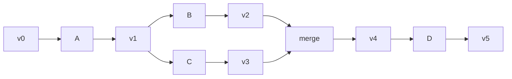

# Chapter 4 — Service Bus

A **service** is the only thing that transforms a blob. Services consume Chapter 3 blobs and produce the stages of Chapter 5.
## 4.1 Prior Art

The service bus draws from three proven systems:

- **seL4 Microkernel IPC** uses synchronous message passing via Endpoints with
  unforgeable capabilities. Every operation requires a capability invocation —
  there is no ambient authority. We adopt capability-based access control and
  synchronous request/response for small payloads, but add async support for
  remote services.

- **Cloudflare Workers RPC** provides JavaScript-native remote procedure calls
  with structured-clone serialization. Services are called as if local, with
  type-safe stubs generated from TypeScript. We adopt the JS-native calling
  convention and structured-clone transport, but add a per-call capability model
  (Cloudflare's access control is service-level, not per-invocation).

- **WASI (WebAssembly System Interface)** defines capability-based resource
  access for WebAssembly components. File handles and socket handles are
  unforgeable tokens. We adopt WIT-like interface definitions for cross-language
  service contracts.


## The service contract

A service is a pure function:

```
(blob, input) -> (new_blob, output)
```

Blob on stdin, input as argv, new blob on stdout, verdict as exit code. The old blob is untouched.

In Rust, the service contract becomes a trait; the bus is a registry:

```rust
use stateless_service_bus::{ServiceRegistry, Service, ServiceError};
use serde_json::json;

// Build the bus: a registry, not a daemon.
let mut registry = ServiceRegistry::default();
registry.register(MyService);

// Invoke: (blob, input) → (new_blob, output).
let blob = Blob::new(&serialized)?;
let input = json!({"op": "transform"});
match registry.invoke("my-service", &blob, &input) {
    Ok((new_blob, output)) => { /* verdict: success */ }
    Err(ServiceError::NotFound) => { /* service missing */ }
    Err(e) => { /* non-zero exit semantics */ }
}
```

## Service manifest

Every service directory holds a `service.json`:

```json
{"name": "tab-hibernate", "version": "1.4.0",
 "input_schema": "schemas/input.json",
 "output_schema": "schemas/output.json",
 "capabilities": ["capture", "compress"]}
```

The manifest is the sole source of truth: name, version, schemas, capabilities. No env vars or config files outside the directory.

## Discovery

A service **exists** iff its directory is on disk. No registry, no catalog — discovery is path resolution:

```python
def resolve(name, search_path):
    for root in search_path:
        if (root / name / "service.json").is_file():
            return root / name
    raise ServiceNotFound(name)
```

Add a service = drop a directory; remove one = delete it. No global state.

## Down is the default

Services are **short-lived processes, not daemons**: they start, transform, exit. Down is the default — the exit code is the health signal. Continuous work is an orchestrator loop.

## Wiring

Services communicate via **stdout→stdin pipelines**:

```bash
hibernate < state.json | compress | hash > next_state.json
```

Exit code is the verdict: `0` success, non-zero failure. No sockets, no HTTP, no brokers.

## Service composition

Three patterns from one primitive:

1. **Chain** — `A -> B -> C`. Output of A feeds B.
2. **Fan-out** — `A -> (B, C) -> merge -> D`, merged deterministically
3. **Route** — `A -> route(condition) -> B or C`; the route outputs a boolean.



## Service registry

A thin wrapper over filesystem discovery — a library, not a daemon:
```python
class ServiceRegistry:
    def lookup(self, name):
        return resolve(name, self.search_path)

    def execute(self, name, blob, input):
        result = subprocess.run(
            [str(self.lookup(name) / "entrypoint"), json.dumps(input)],
            input=blob, capture_output=True)
        if result.returncode:
            raise ServiceError(name, result.returncode)
        return result.stdout, result.returncode
```

## Pipeline executor

```python
class Pipeline:
    def run(self, steps, blob):
        for step in steps:
            blob, code = self.registry.execute(step, blob, {})
            if code:
                raise PipelineError(step, code)
        return blob

    def run_parallel(self, fan_out, blob, merge_fn):
        out = [self.registry.execute(s, blob, {})[0] for s in fan_out]
        return merge_fn(out)
```

The executor persists no state between invocations.

## Error handling

**Non-zero exit = failure.** No partial success: the blob is transformed or discarded; the old blob stays truth until the new one is valid. No retry inside services — the orchestrator retries.

## The service sandbox


A conforming service:

1. **No ambient state** — reads only blob and argv
2. **No side effects** — writes only stdout and exit code
3. **Deterministic** — same inputs, same output blob
4. **Sealed** — its directory is immutable at runtime

Violation = non-conformance.

## Conformance

Conformance is proven by the suite, identical across services:

1. **Round-trip** — produces a valid blob
2. **Idempotency** — same input, same output
3. **Sandbox** — cannot read or write outside its directory
4. **Failure** — invalid input yields non-zero exit, never a corrupted blob
---

Next: Chapter 5 — Progressive Restore, where services become the stages of restoring a complex system.

Full protocol design: [RFC-0003](../rfcs/0003-service-bus-protocol.md).
