# Chapter 5 — Progressive Restoration

> How does a system come back from a blob?

## 5.1 The restoration ladder

A blob is inert, serialized fact. Restoration turns it back into a running system — in stages:

```
shell → structure → interactivity → full state
```

Every rung is a *usable* system — never blank, never waiting.

```rust
fn progressive_restore(blob: StateBlob) -> Result<Service, RestoreError> {
    let mut service = Service::empty();
    for stage in RestoreStage::ladder() {
        match service.restore(stage, &blob)? {
            RestoreOutcome::Ready   => return Ok(service),
            RestoreOutcome::Partial  => { /* usable at this rung */ }
            RestoreOutcome::Failed   => break, // fall back to previous checkpoint
        }
    }
    Ok(service) // partial restore is a usable system
}
```

## 5.2 Like a progressive JPEG

A progressive JPEG shows a blurry preview on the first bytes, then refines as data arrives. Restore mirrors it: shell is the preview, structure sharpens it, interactivity wires it, full state completes it.

## 5.3 Stage definitions
| Stage | Restores | Cost | Enables |
|-------|----------|------|---------|
| Shell | Skeleton, scroll, form placeholders | ~0 ms | Sees "their tab" |
| Structure | Real DOM, styles, layout | ~50 ms | Reads, scrolls |
| Interactivity | Event listeners, JS heap | ~200 ms | Clicks, types |
| Full state | Timers, network, deep JS state | ~500 ms | As if never left |

Every stage is a checkpoint; the system is *usable* at each.

## 5.4 Priority ordering

One rule drives the order:

> Restore what the user perceives first.

1. Scroll and viewport — the sense of place
2. Static structure — the page they left
3. Form inputs — unsaved work
4. JS heap — the interactive layer
5. Network / timers — most expensive, most stale


## 5.5 Pseudocode: the orchestrator

```js
async function progressiveRestore(blob, stages) {
  if (!verifyHash(blob)) throw new BlobIntegrityError(blob.hash);
  const ctx = createRestoreContext(blob);

  for (const stage of stages) {
    const cp = await stage.apply(ctx);         // pure: (ctx) → (ctx, cp)
    emit("restore:stage", { stage: stage.name, checkpoint: cp });
    if (stage.isInteractive) ctx.unblockInput(); // rest behind it
  }

  if (!verifyRestoredState(ctx, blob))
    throw new RestoreVerificationError(blob.hash);
  return ctx.system;
}
```

Each stage is a pure function; the orchestrator is their pipeline.

## 5.6 Restoration timeline

```mermaid
gantt
    dateFormat X
    axisFormat %L ms

    section Perceived
    Shell     :done, shell, 0, 10
    Structure :active, dom, after shell, 50

    section Interactive
    Interactivity :crit, js, after dom, 150
    Full state    :full, after js, 300
```



- **0 ms** — shell painted: the user sees "their tab"
- **~50 ms** — structure: readable, scrollable
- **~200 ms** — interactivity: clickable, typeable
- **~500 ms** — full state: as if never left

## 5.7 The freeze-dried tab model

Freeze-drying removes water, keeps structure. A freeze-dried tab removes the *runtime* (memory, processes, connections), keeps the *state* (DOM, JS heap, scroll, form). Capture order is restore order reversed:

```
capture:  static first → DOM after → JS runtime last
restore:  static first → DOM after → JS runtime last
```

Static capture is cheap (skeleton, screenshot, offsets) — the shell. DOM is structured — the page the user left. The JS runtime is expensive — a live heap and engine — so it restores last: most cost, least *perceived* value.

## 5.8 Graceful degradation

Any stage can fail: **a partial restore is a usable system, not an error state.**

| Failure at | Result |
|-----------|--------|
| Shell | Blank page, scroll preserved |
| Structure | Snapshot remains; can navigate |
| Interactivity | Readable; retry later |
| Full state | Interactivity remains; net lazy |

Rule: **never take away a rung the user already has** — fail to the previous checkpoint.

## 5.9 Cross-references

- **[Chapter 3 — State Blob](03-state-blob.md)** — its layered, versioned, hashed structure makes staged restore possible; a monolithic blob forces all-or-nothing restore.
- **[Chapter 4 — Service Bus](04-service-bus.md)** — each stage is a service invocation `(blob, stage) → (partial state, checkpoint)`; the orchestrator is their pipeline.

---

*The blob is truth; restoration makes it visible, then interactive, then alive.*
