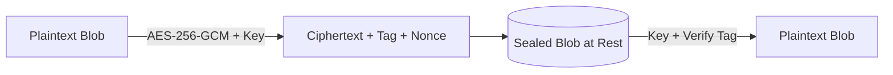
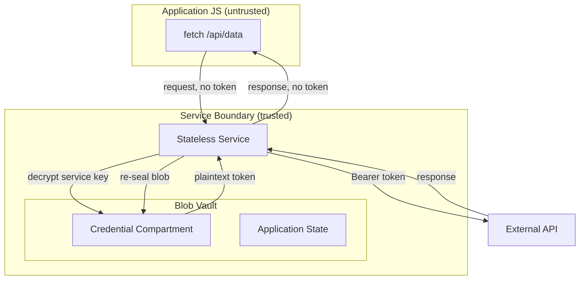

# Chapter 7 — Security Model: The Blob as a Secure Boundary

> **The blob is not just a serialization format. It is the security boundary — the only place secrets can live, and the only place they can be stolen.**

---

## 6.1 Why the Blob Is a Natural Security Boundary

In a traditional application, secrets are scattered: environment variables, in-memory caches, connection pools, globals, DOM attributes, `localStorage`. Each is a separate attack surface. The stateless model collapses them into one place — the **state blob**, the only source of truth (Invariant 1, Chapter 1). Consequences:

- **One surface to defend.** Seal the blob and you have sealed every secret the system holds.
- **No ambient leakage.** No global state, cache, or connection pool exists for an attacker to scrape.
- **Explicit boundaries.** Serialization, transmission, and deserialization are well-defined transitions where encryption, validation, and access control apply.

---

## 6.2 Encryption at Rest: The Sealed Blob

A blob at rest — a file, a database row, a payload in transit — is **sealed** by default: AES-256-GCM encrypted with a key derived from the user's credentials (Argon2id), never stored with the payload. The sealed blob has three properties:

1. **Confidentiality** — without the key, the ciphertext is indistinguishable from random bytes.
2. **Integrity** — the GCM tag binds ciphertext to key; any modification is detected.
3. **Freshness** — a per-seal nonce ensures the same plaintext seals differently every time.



The service receives the unsealed blob in memory, transforms it, and re-seals the result before returning.

---

## 6.3 The Credential Compartment

Credentials — API keys, OAuth tokens, passwords, cookies — live in a dedicated section of the blob encrypted with a **service-specific key**, available only to the service process during its invocation. Application code requests a credential by name; the service runtime decrypts it, uses it, discards it. The credential is never written to application memory, never logged, never serialized into application state.

```
┌───────────────────────────────┐
│        Sealed Blob            │
│  ┌─────────────────────────┐  │
│  │ Application State       │  │
│  │ (plaintext in memory)   │  │
│  └─────────────────────────┘  │
│  ┌─────────────────────────┐  │
│  │ Credential Compartment  │  │
│  │ (encrypted, service key)│  │
│  │ • API keys • tokens     │  │
│  └─────────────────────────┘  │
└───────────────────────────────┘
```

---

## 6.4 The Blob Vault



The token never crosses the service boundary. The application JS receives only the API response — never the credential that fetched it.

---

## 6.5 Pseudocode: Secure Fetch Using the Vault

```pseudocode
// Application code — runs in the browser, untrusted
function fetchUserData(blob, requestId):
    result = invoke("user-service", {
        action: "fetch-profile",
        requestId: requestId
        // No token. The app cannot leak what it does not have.
    })
    return result.profile

// Service code — runs in the trusted boundary
function userService(blob, input):
    token = vault.get("github-token")  // decrypted in service memory only
    response = http.get("https://api.github.com/user", {
        headers: { "Authorization": "Bearer " + token }
    })
    // The token is never returned; the runtime re-seals
    // the credential compartment before responding.
    return { profile: response.body }
```

The application code is structurally incapable of leaking the credential: it is absent from the blob the app receives, absent from the response, absent from every closure and global the app can reach.

---

## 6.6 XSS Cannot Steal What It Cannot See

XSS — an injected script reading `document.cookie`, `localStorage`, or the DOM — finds nothing to steal:

1. **No credentials in the DOM.** The compartment is encrypted; application state contains no tokens.
2. **No long-lived memory.** The service is a short-lived process — runs, transforms, exits. No persistent JS heap exists to scrape.
3. **No ambient authority.** Application code carries no implicit permissions. Every external call is a service invocation gated by the runtime. An injected script cannot make authenticated requests — it does not have the credential, and the boundary prevents it from getting one.

The attacker can still manipulate application state — but application state is not the system. The system is the blob, and the blob is sealed.

---

## 6.7 Threat Model: What the Blob Protects Against

| Threat | Mechanism | Protection |
|---|---|---|
| **Memory scraping** | Blob sealed at rest; service memory ephemeral | Attacker reads ciphertext or nothing |
| **XSS** | No credentials in app state or DOM | Injected script finds no tokens |
| **Tabnabbing** | Blob origin-bound; service origin-scoped | Phishing tab cannot read another origin's blob |
| **Session hijacking** | Credentials service-only, never in JS | Stolen cookie is useless without the service key |
| **Log / crash-dump leakage** | Blob sealed before persistence | Logs and dumps contain ciphertext, not plaintext |

The blob does not eliminate these threats — it **contains** them. The attacker must break the encryption or compromise the service runtime, both well-studied, defensible boundaries.

---

## 6.8 What the Blob Does NOT Protect Against

- **Compromised service.** A malicious or compromised service can decrypt the compartment and exfiltrate plaintext. The service boundary is trusted by definition — a compromised service is a compromised system.
- **Physical access.** An attacker with device access can extract the derived key from memory, capture the passphrase, or tamper with the unsealing boundary. The blob protects against remote extraction, not local compromise.
- **Side channels.** Timing, power, and cache attacks during unsealing are outside the model.
- **Application logic bugs.** If app code accidentally echoes a credential (e.g. logs the service output), the blob cannot prevent it.

The blob is a **boundary**, not a **guarantee**: it reduces the attack surface; it does not eliminate it.

---

## 6.9 Least Privilege per Service

The stateless model enforces least privilege **structurally**, not as policy. Each service:

- Receives only the blob it needs, not the whole system state.
- Can decrypt only its own credential compartment.
- Runs with minimum capabilities — no filesystem or network access unless declared.
- Is ephemeral — it exits after invocation, leaving no residual permissions.

The service runtime enforces these invariants; application code cannot violate them.

---

## 6.10 Cross-References

- **Chapter 2 — The State Blob** defines the sealing and serialization contracts that make the encrypted blob possible.
- **Chapter 4 — Service Bus** defines the service sandbox — the trusted boundary that enforces the credential compartment and least privilege.
