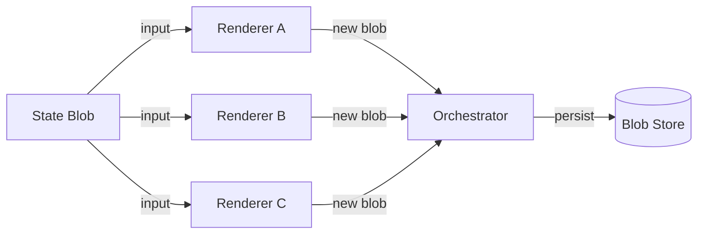

# Chapter 8 — Modularity & Moddability

> The engine is a pure function of the blob. Change the engine, keep the blob —
> the system survives. Modularity by construction, not by convention.

---

## 8.1 Modularity by Default

Traditional applications couple components through shared mutable state:
replacing any piece means untangling references — brittle, manual work.

The stateless model removes this coupling structurally. Invariant 1 (Chapter 1)
makes the blob the only source of truth; no engine instance holds state outside
it. The engine is a pure function of the blob — replaceable without touching the
data it operates on. Modularity is not added with DI frameworks or plugin APIs;
it falls out of separating state from transformation.

## 8.2 Swappable Services

A **service** is the unit of computation (Chapter 4): it reads a blob, produces
a new blob, exits. Its manifest (`service.json`) declares input schema, output
schema, and capabilities. Discovery is by path, invocation by manifest, so
swapping implementations needs no orchestrator change — same contract, different
body: DOM, terminal, or headless renderer; rigid-body, particle, or null
physics; local LLM, cloud API, or cached replay.

The replacement must satisfy the manifest — same input schema, same output
schema — and nothing else: no shared init, no leaked globals, no ambient state.
Conformance is proven by the test suite.
```rust
// A renderer transforms a blob into output — swappable at runtime.
trait Renderer { fn render(&self, blob: &Blob) -> String; }

struct JsonRenderer;  // emits JSON
struct YamlRenderer;  // emits YAML

struct Registry { renderer: Box<dyn Renderer> }

impl Registry {
    fn swap(&mut self, r: Box<dyn Renderer>) { self.renderer = r; }
    fn render(&self, blob: &Blob) -> String { self.renderer.render(blob) }
}

// Usage: same blob, swap renderer without touching the blob.
let mut reg = Registry { renderer: Box::new(JsonRenderer) };
reg.swap(Box::new(YamlRenderer));  // now emits YAML
```


## 8.3 The State Blob as the Interface Between Mods

A **mod** is a service not part of the original deployment — discovered, invoked,
and sandboxed exactly like built-ins; the user, not the vendor, installed it.

The blob is the contract between mods: a mod reads only what the blob exposes,
writes only its declared output schema, and never shares mutable memory.

- **Compose** — a skin mod and a physics mod touch different blob sections; no conflict.
- **Testable** — same blob and input, same output (Invariant 2).
- **Removable** — delete the directory; discovery skips it.

## 8.4 Version-Independent State

Schema versioning (Chapter 3) makes state **survive engine rewrites**: a blob
from service v1 migrates forward to v50 — monotonic, lossless, no skip-version.
A complete rewrite — new language, new algorithms, new renderer — needs no
data-migration project: the new engine reads the same schema and old blobs
migrate forward. The blob **is** the export format; migration is the only
transform.

## 8.5 The Plugin System You Don't Have To Build

Most applications build a plugin system: API, registry, sandbox, lifecycle,
permissions. The service bus already is one: **install** by dropping a directory
on disk; **discovery** by the filesystem walker; **invocation** with blob on
stdin, input as argv; **sandbox** with no ambient state, no env, no globals;
**permissions** via the credential compartment (Chapter 7); **removal** by
deleting the directory.

The plugin API is the blob schema; the registry is the filesystem; the lifecycle
is start → transform → exit.

## 8.6 Examples

- **Custom UI skins** — a renderer service reads the same app blob but applies a
  different visual projection; switching renderer path changes the theme.
- **Game mods at engine level** — a mod replaces the physics service. Game state
  lives in the blob; the mod consumes the same `physics` schema; new physics runs
  without recompilation.
- **Browser extensions as stateless services** — an extension intercepts the
  render pipeline: reads the page blob, transforms it, emits a new blob, sandboxed
  like any service.

## 8.7 Service Swap: Same Blob, Different Implementation



The orchestrator selects a service by manifest capability, user preference, or
experiment. Every renderer reads the same blob and produces a new one;
snapshot, restore, sync, and security are unchanged.

## 8.8 Pseudocode: Mod Loader

```pseudocode
function loadAndSwap(blob, capability, modPath) {
    manifest = readManifest(modPath + "/service.json")
    assert manifest.capabilities.contains(capability)

    result = invokeService(
        path = modPath + "/" + manifest.entrypoint,
        stdin = serialize({ blob, capability }),
        argv = []
    )

    assert result.exitCode == 0
    newBlob = deserialize(result.stdout)
    assert validate(newBlob, manifest.outputSchema)
    return newBlob
}
```

The loader validates the manifest, invokes the service, checks the exit code,
and validates the output against the declared schema — no partial state, no
silent failures, no schema drift.

## 8.9 Cross-References

- **Chapter 3 — The State Blob** defines the versioned, schema-validated
  contract that makes swappable engines and inter-mod interfaces possible.
- **Chapter 4 — The Service Bus** defines discovery, manifest, sandbox, and
  invocation — the plugin system every mod rides on.
