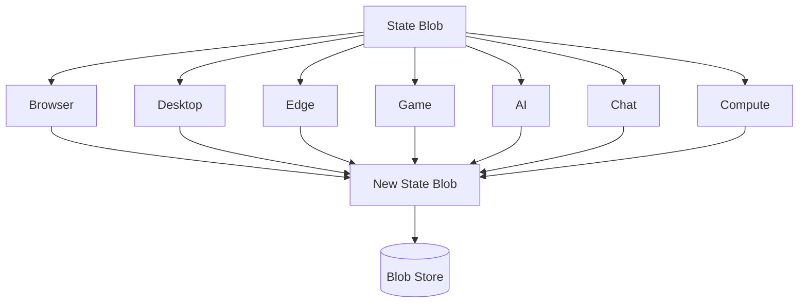

# Chapter 9 — Applications

> The stateless model is not a niche pattern. It is a universal decomposition — state as a blob, engines as pure functions — and every domain that adopts it reshapes around it.

## 9.1 The Application Landscape

The core loop ([Chapter 2](02-core-principles.md)) is domain-agnostic: a blob enters, a service transforms it, a new blob exits. This chapter maps that loop to seven domains; only the blob schema and service contract change.

The core loop is one function signature. Two different domains — a browser tab and a multiplayer game — share it verbatim.

```rust
/// The universal core loop: (state_blob, input) -> (new_state_blob, side_effects).
/// Both the blob and input are domain-specific; the loop is not.
fn step<B, I, E>(blob: B, input: I, engine: impl Fn(B, I) -> (B, Vec<E>)) -> (B, Vec<E>) {
    engine(blob, input)
}

// --- Domain A: Browser Tab -------------------------------------------------
struct TabBlob { dom: String, scroll: u32 }
enum TabInput { Navigate(String), Scroll(u32) }
fn tab_engine(blob: TabBlob, input: TabInput) -> (TabBlob, Vec<()>) {
    match input {
        TabInput::Navigate(url) => (TabBlob { dom: fetch(&url), scroll: 0 }, vec![]),
        TabInput::Scroll(y) => (TabBlob { scroll: y, ..blob }, vec![]),
    }
}

// --- Domain B: Game World --------------------------------------------------
struct GameBlob { entities: Vec<Entity>, tick: u64 }
enum GameInput { PlayerMove { id: u32, dir: Dir }, CastSpell { id: u32 } }
fn game_engine(blob: GameBlob, input: GameInput) -> (GameBlob, Vec<Effect>) {
    let mut b = GameBlob { tick: blob.tick + 1, ..blob };
    match input {
        GameInput::PlayerMove { id, dir } => (b, vec![Effect::Moved(id, dir)]),
        GameInput::CastSpell { id } => (b, vec![Effect::SpellCast(id)]),
    }
}
```



One blob, many services. Every service is stateless; the store persists the only source of truth.

## 9.2 Browsers — Tabs as Blobs

**Problem.** A background tab holds DOM, heap, scroll, connections — tens of MB, lost on restart.

**Solution.** Each tab serializes to a **tab blob** on eviction ([Chapter 3](03-state-blob.md)). Runtime destroyed; blob persists.

**Benefit.** Switching is restore-from-blob: milliseconds. Thousands of tabs cost KB, not GB.

**Solution.** Each tab serializes to a **tab blob** on eviction: DOM, heap, viewport, scroll — complete state ([Chapter 3](03-state-blob.md)). The runtime is destroyed; the blob persists.

**Benefit.** Switching is restore-from-blob: milliseconds, not seconds. Thousands of tabs occupy kilobytes, not gigabytes. State survives crash and restart, restored progressively ([Chapter 5](05-progressive-restore.md)).

## 9.3 Desktop Apps — Windows as Blobs

**Problem.** Electron and Tauri apps hold a full renderer process per window. Minimized windows cost hundreds of megabytes; closing loses state.

**Solution.** Each window maps to a blob. On minimize: serialize window state, destroy the renderer. On restore: hydrate from the blob. The engine is a pure function of (blob, input) → (new blob, view).

**Benefit.** A minimized window costs zero renderer memory — only its blob. A closed window resurrects from its blob; thousands of windows cost the memory of one. Crash recovery is structural.

## 9.4 Serverless & Edge — Cold Starts to Microseconds

**Problem.** Cold starts — runtime init, dependency load, cache warm-up — take 100ms to seconds. Warm state per instance caps density.

**Solution.** The function is a pure service: `(blob, request) → (blob, response)`. No warm-up; the runtime loads only the blob, executes, and the engine is discarded. The blob store holds state between invocations.

**Benefit.** Cold start becomes blob-load: microseconds. Any instance serves any request; density is CPU-bound, not memory-bound. The blob *is* the session.

## 9.5 Games — World State as Synchronized Blob

**Problem.** Multiplayer games sync world state through a central server — a single point of failure, a latency bottleneck, a cost center. Clients hold partial, interpolated views.

**Solution.** The world is a blob. Each player's client is a mesh peer ([Chapter 6](06-mesh-sync.md)) holding the world blob and running the simulation locally. Moves, item use, physics are CRDT operations broadcast across the mesh; every peer converges to the same world blob.

**Benefit.** No central server — the world lives in the mesh. Latency drops to local; player count scales with the mesh; the game survives any single node failing because no node is special.

## 9.6 AI Inference — Model as Stateless Service

**Problem.** Inference servers hold weights, conversation history, and session state in memory. Scaling demands large instances or sticky sessions; GPU memory caps concurrent sessions.

**Solution.** The model is a stateless service: `(context_blob, prompt) → (new_context_blob, response)`. Conversation state — context, KV-cache, embeddings — is a blob. Any instance loads the context blob, runs the prompt, returns the new blob. Weights are shared read-only.

**Benefit.** Millions of concurrent sessions: context blobs in object storage, any GPU serves any session, migration is a blob copy. Inference is a pure function — same prompt plus same blob, same response — and GPUs stay utilized.

## 9.7 Mesh Chat — P2P Messaging

**Problem.** Messaging apps depend on central servers for routing, storage, presence — surveillance targets, cost centers, single points of failure. Offline messaging is an afterthought.

**Solution.** Each chat is a blob — an ordered operation journal replicated across peers via CRDT. Messages are operations appended to the blob. No server: peers broadcast directly or via relay nodes ([Chapter 6](06-mesh-sync.md)); the blob converges, the journal is the history.

**Benefit.** Serverless by construction: no server to compromise, subpoena, or bill. Offline-first: messages sync on contact. History is a blob — exportable, verifiable, sealed ([Chapter 7](07-security-model.md)).

## 9.8 Scientific Computing — Idle Compute as a Mesh Resource

**Problem.** Compute clusters idle between jobs; idle capacity is not shared across institutions. Researchers queue for hours while peers' machines sit unused.

**Solution.** A compute job is a stateless service: `(input_blob, parameters) → (result_blob, artifacts)`. Idle machines join a mesh as compute peers; a job dispatched from one peer executes on another and returns as a blob. The mesh routes work to idle peers — no central cluster, no queue.

**Benefit.** Global idle capacity becomes a shared supercomputer; institutions share cycles instead of buying redundant hardware. Democratization: a researcher with a laptop accesses aggregate mesh compute, with deterministic, reproducible results ([Chapter 2](02-core-principles.md)).

## 9.9 Cross-References

- **Chapter 2 — Core Principles** — the one-sentence model applies universally; only the blob schema changes.
- **Chapter 3 — State Blob** — every application's blob is structured, versioned, content-addressed.
- **Chapter 4 — Service Bus** — every domain's engine is a service: discovered, wired, swappable.
- **Chapter 5 — Progressive Restore** — tabs and windows restore progressively from their blobs.
- **Chapter 6 — Mesh Sync** — games, chat, and compute share state via CRDT operations.
- **Chapter 7 — Security Model** — every blob is sealed; every service boundary enforces least privilege.
- **Chapter 8 — Modularity & Moddability** — swappable engines make each application a platform.

---

*The stateless model is not a pattern for one domain. It is a universal interface — state in, service out, truth in the blob. Every application in this chapter is the same architecture, expressed in a different vocabulary.*
