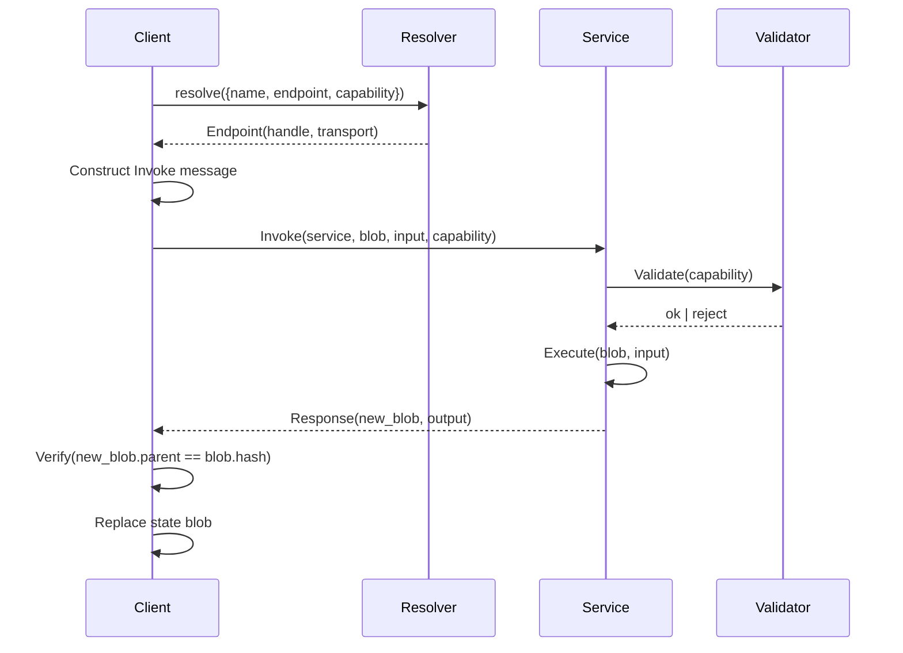

# RFC-0003: Service Bus Protocol Design

**Status:** Draft
**Author:** Stateless Engineering
**Created:** 2026-08-05

## Abstract

This document designs the **Service Bus Protocol** — the communication layer
that connects a webshell (client) to stateless services. It supports
asynchronous request/response, streaming, capability-based authorization,
and local/mesh/cloud endpoint resolution.

## 1. Prior Art

### 1.1 seL4 IPC

seL4 uses synchronous message passing via **Endpoints**:

- **Synchronous:** Sender blocks until receiver is ready
- **Capabilities:** Each endpoint access requires a capability
- **Message registers:** Fast path for small messages (up to 6 words)
- **Shared memory:** Large payloads via mapped pages
- **Notification:** Async signals (like eventfd)

**Adopted:** Capability-based access, sync request/response for small
payloads, shared memory for large.

**Diverged:** seL4 is purely synchronous. We need async (non-blocking)
because services may be remote.

### 1.2 Cloudflare Workers RPC

Cloudflare's built-in RPC:

- **JavaScript-native:** Call methods on remote objects as if local
- **Structured clone:** Serialization via structured clone algorithm
- **Type-safe:** TypeScript generates client stubs
- **Service bindings:** Declarative endpoint configuration
- **Cross-language:** Python↔JS interop via serialization

**Adopted:** JS-native calling convention, structured clone as baseline
transport, cross-language support.

**Diverged:** Cloudflare RPC has no capability model — access control is
at the service level, not per-call. We need per-call capability tokens.

### 1.3 WASI (WebAssembly System Interface)

WASI provides a capability-based system interface for WASM:

- **Capabilities:** File handles, socket handles as unforgeable tokens
- **WIT (WASM Interface Types):** Language-agnostic type definitions
- **Component model:** Composable interfaces across languages

**Adopted:** WIT-like interface definitions, capability-based resource
access, component composition.

## 2. Protocol Overview

```
┌─────────────┐     Service Bus Protocol     ┌─────────────┐
│  Webshell   │ ◄──────────────────────────► │   Service   │
│  (Client)   │                               │   (Server)  │
│             │  ┌─────────────────────────┐  │             │
│  ┌───────┐  │  │  Endpoint Resolver      │  │  ┌───────┐  │
│  │ State │  │  │  ┌─────┐ ┌────┐ ┌────┐  │  │  │ Pure  │  │
│  │ Blob  │  │  │  │local│ │mesh│ │cloud│  │  │  │ Func  │  │
│  └───────┘  │  │  └─────┘ └────┘ └────┘  │  │  └───────┘  │
└─────────────┘  └─────────────────────────┘  └─────────────┘
```

### 2.1 Endpoint Resolution

Services are resolved by **capability**, not by address:

```typescript
const service = bus.resolve({
  name: "render-html",
  version: ">=1.0.0",
  endpoint: "local" | "mesh" | "cloud",
  capability: token
});
```

Resolution order:
1. **Local:** A service in the same process/worker
2. **Mesh:** A service reachable via WebRTC/BLE from a peer
3. **Cloud:** A service reachable via HTTPS from a remote host

### 2.2 Transport Layer

| Transport | Use Case | Serialization |
|-----------|----------|---------------|
| Function call | Local service (same process) | Direct reference |
| postMessage | Local service (different worker) | Structured clone |
| WebRTC data channel | Mesh peer | Structured clone / CBOR |
| HTTPS | Cloud endpoint | JSON / CBOR / Protobuf |
| WebRTC media track | Streaming (audio/video) | MediaStream |

### 2.3 Message Envelope

```json
{
  "$schema": "https://stateless-architecture.org/schemas/message/v0.1",
  "id": "msg-uuid",
  "type": "invoke" | "stream" | "cancel" | "response" | "error",
  "service": "render-html",
  "method": "render",
  "capability": "sha256:cap-token...",
  "blob_id": "sha256:blob...",
  "payload": { ... },
  "timestamp": "2026-08-05T20:00:00Z",
  "ttl": 30000
}
```

## 3. Request/Response

```typescript
// Synchronous-style (async underneath)
const result = await bus.invoke({
  service: "render-html",
  method: "render",
  blob: stateBlob,
  input: { url: "https://example.com" },
  capability: token
});

// The result is a new blob + output
assert(result.blob !== stateBlob);  // Non-destructive
assert(result.output.html !== undefined);
```

**Internals:**

1. Client constructs an `Invoke` message with capability token
2. Endpoint resolver locates the service
3. Service validates the capability (scope, expiry, signature)
4. Service executes: `(blob, input) → (new_blob, output)`
5. Response message returned with new blob
6. Client replaces its state blob with the new one

## 4. Streaming

For real-time rendering, audio, or progressive output:

```typescript
const stream = bus.stream({
  service: "audio-synthesize",
  method: "speak",
  blob: stateBlob,
  input: { text: "Hello" },
  capability: token
});

for await (const chunk of stream) {
  // chunk = { blob: Blob, output: { audioFrame: ArrayBuffer } }
  playAudio(chunk.output.audioFrame);
}
```

**Protocol:** After initial `invoke`, the server sends a stream of
`response` messages. Each message contains a delta blob (or the full blob
if small). The client sends `cancel` to stop.

## 5. Capability Tokens

### 5.1 Structure

```json
{
  "$schema": "https://stateless-architecture.org/schemas/capability/v0.1",
  "id": "sha256:cap...",
  "issuer": "user:alice",
  "subject": "service:render-html",
  "scope": ["invoke", "stream"],
  "constraints": {
    "maxInvocations": 1000,
    "maxBytes": 10485760,
    "expires": "2026-08-06T20:00:00Z"
  },
  "proof": {
    "type": "Ed25519",
    "signature": "..."
  }
}
```

### 5.2 Capability Derivation

```
Master Capability (held by user)
  └── Derived Capability: service=render-html, scope=[invoke]
      └── Derived Capability: service=render-html, scope=[invoke],
          maxBytes=1MB, expires=+1h
          └── ... (further restriction)
```

Each derivation **restricts** — never expands — the parent's scope.
This follows the principle of least authority.

### 5.3 Delegation

A capability can be delegated to a peer:

```typescript
const restrictedToken = await token.restrict({
  scope: ["invoke"],
  maxInvocations: 100,
  peer: "peer-bob"
});
```

The restricted token is signed by the delegator, verifiable by the service
via the capability chain back to the root issuer.

## 6. Endpoint Resolution

### 6.1 Local

```typescript
// Same-process service. No serialization overhead.
bus.register("render-html", new RenderService());
```

### 6.2 Mesh (WebRTC + BLE)

```typescript
// Discovered via WebRTC signaling or BLE advertisement.
// The mesh peer advertises available services.
bus.discoverOnMesh();  // Returns ServiceManifest[]
const service = bus.resolve({
  name: "render-html",
  endpoint: "mesh",
  capability: meshCapability  // Capability issued by the mesh peer
});
```

### 6.3 Cloud

```typescript
// Known endpoint URL. Capability issued by the service provider.
const service = bus.resolve({
  name: "inference-v2",
  endpoint: "https://inference.example.com",
  capability: cloudCapability
});
```

### 6.4 Endpoint Selection Strategy

```typescript
// Priority: local > mesh > cloud
// Override: prefer cloud for heavy compute
const service = bus.resolve({
  name: "render-html",
  strategy: "fastest",  // or "cheapest", "most-private", "any"
  capability: token
});
```

## 7. Cross-Language Support

### 7.1 Rust (Native)

```rust
#[stateless_service]
fn render_html(blob: &Blob, input: RenderInput) -> Result<(Blob, RenderOutput), ServiceError> {
    // ...
}
```

The `#[stateless_service]` macro generates:
- A WIT interface definition
- A service manifest
- Serialization/deserialization code

### 7.2 JavaScript (In-Browser)

```javascript
bus.register("render-html", {
  async invoke(blob, input) {
    const html = await render(input.url);
    return {
      blob: blob.child({ lastRender: html }),
      output: { html }
    };
  }
});
```

### 7.3 WIT Interface Definition

```wit
interface render-html {
  record render-input {
    url: string,
    viewport: option<viewport-dimensions>,
  }

  record render-output {
    html: string,
    timing: timing-info,
  }

  render: func(blob: blob, input: render-input)
    -> result<(blob, render-output), service-error>;
}
```

## 8. Security Model

### 8.1 Threat Model

| Threat | Mitigation |
|--------|-----------|
| Unauthorized invocation | Capability tokens required per call |
| Capability theft | Short-lived tokens, derivation chain |
| Replay attacks | Timestamp + nonce in each message |
| Blob tampering | Content-hash verification on response |
| Service impersonation | Manifest signing, capability issuer chain |
| Egress data exfiltration | Capability scope limits byte count |

### 8.2 Blob Non-Destructive Guarantee

Services **must not** mutate the input blob. They return a new blob.
This is enforced by the reference implementation (Rust: `&Blob` is immutable)
and verified by clients (input blob hash must not change).

### 8.3 Sandboxing

Services run in isolated contexts:
- **Local:** Web Worker or WASM sandbox
- **Mesh:** Service runs in the peer's sandbox
- **Cloud:** Service runs in the provider's sandbox

No service has access to the host's filesystem, network, or memory outside
its sandbox. All I/O is via the blob and capability-granted resources.

## 9. Sequence Diagram



## 10. Open Questions

1. **Capability revocation:** How to revoke a capability before expiry?
   (CRL? OCSP-like? Merkle tree of revocations?)
2. **Streaming backpressure:** How to handle a fast producer / slow consumer?
   (Credit-based flow control?)
3. **Mesh discovery:** mDNS? DHT? Central registry?
4. **Cross-language types:** WIT is immature. Is Protobuf better for now?
5. **Idempotency:** Should invoke be idempotent (same message → same result)
   for reliability?
