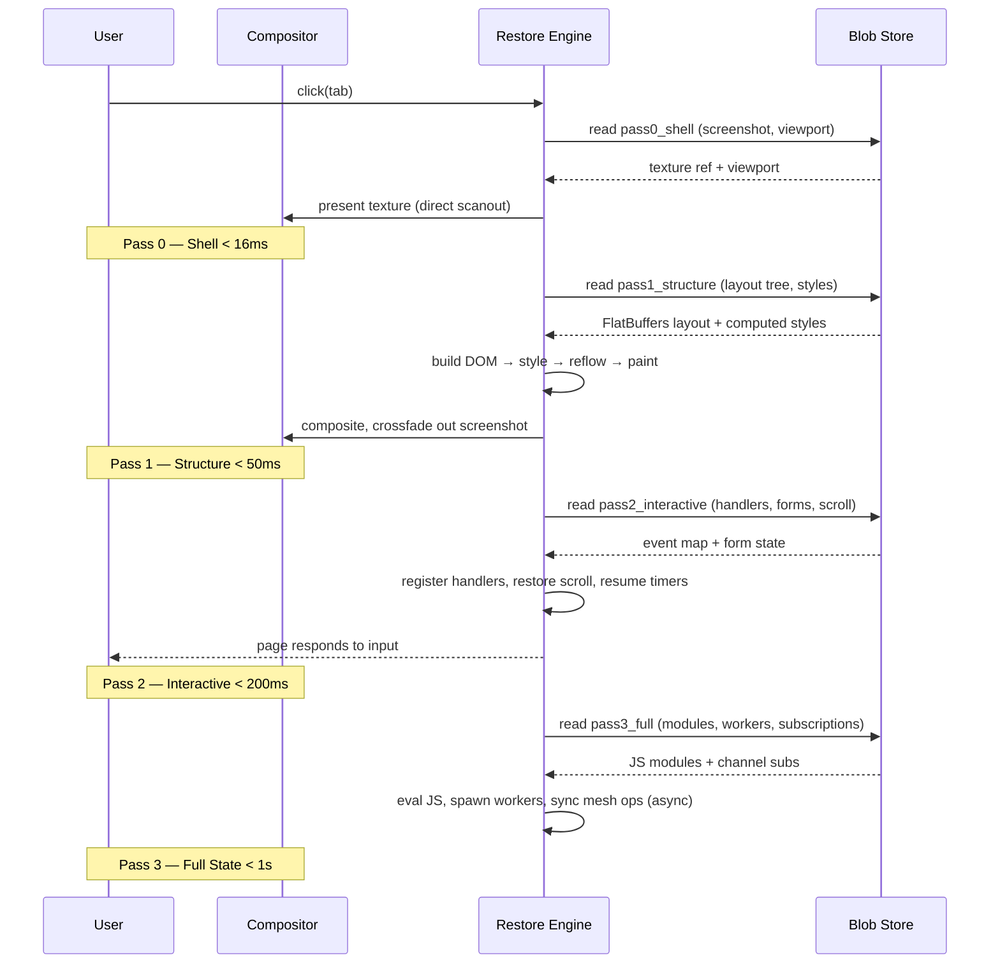

# Spec: Progressive Restore Engine

**Version:** 0.1.0
**Status:** Draft
**Authors:** Stateless Engineering

## 1. Overview

The Progressive Restore Engine (PRE) is the runtime system that materializes a
hibernated tab into a live, interactive page. It executes four sequential
**passes**, each meeting a strict timing budget, with fallback strategies at
every stage.

The PRE is modeled after:
- **React Concurrent Mode** — interruptible, prioritized, Suspense-like boundaries
- **Game level streaming** — async asset loading with progressive activation
- **OS compositor** — direct texture presentation for instant visual feedback

## 2. Architecture

```
┌──────────────────────────────────────────────────────────────────┐
│                    Progressive Restore Engine                     │
│                                                                  │
│  ┌─────────┐   ┌──────────┐   ┌─────────────┐   ┌───────────┐  │
│  │ Pass 0  │ → │ Pass 1   │ → │ Pass 2      │ → │ Pass 3    │  │
│  │ Shell   │   │ Structure│   │ Interactive │   │ Full State│  │
│  │ <16ms  │   │ <50ms   │   │ <200ms     │   │ <1s      │  │
│  └────┬────┘   └────┬─────┘   └──────┬──────┘   └─────┬─────┘  │
│       │             │                │                 │        │
│  Compositor    Layout Tree      Event Handlers    JS + Network  │
│  Texture       DOM + Styles     Forms + Timers    Animation     │
│                                                                  │
│  ┌──────────────────────────────────────────────────────────┐   │
│  │              Blob Store (source of truth)                 │   │
│  │  ┌────────┐  ┌─────────┐  ┌────────────┐  ┌──────────┐  │   │
│  │  │ Shell  │  │ Layout  │  │ Interactive│  │ Full     │  │   │
│  │  │ Section│  │ Section │  │ Section    │  │ Section  │  │   │
│  │  └────────┘  └─────────┘  └────────────┘  └──────────┘  │   │
│  └──────────────────────────────────────────────────────────┘   │
└──────────────────────────────────────────────────────────────────┘
```

## 3. Blob Structure for Restoration

## 2.5 Four-Pass Sequence (Mermaid)



The blob carries **four sections**, one per pass:

```json
{
  "$schema": "https://stateless-architecture.org/schemas/state-blob/v0.1",
  "id": "sha256:...",
  "payload": {
    "_restore": {
      "pass0_shell": {
        "screenshot": "sha256:img-gpu-texture",
        "viewport": { "width": 1920, "height": 1080, "dpr": 2 },
        "favicon": "sha256:...",
        "title": "Example Page",
        "url": "https://example.com",
        "backgroundColor": "#ffffff"
      },
      "pass1_structure": {
        "format": "flatbuffers",
        "tree": "sha256:layout-tree-fb",
        "styles": "sha256:computed-styles",
        "fonts": ["sha256:font1", "sha256:font2"],
        "images": ["sha256:img1", "sha256:img2"]
      },
      "pass2_interactive": {
        "eventHandlers": "sha256:evt-map",
        "formState": { "/input/email": "user@example.com" },
        "scrollPositions": { "/main": 320 },
        "timers": [{"id": 1, "type": "interval", "period": 1000}],
        "websocket": { "url": "wss://example.com/ws", "lastEventId": 42 }
      },
      "pass3_full": {
        "jsModules": ["sha256:module1.js", "sha256:module2.js"],
        "workers": ["sha256:worker1.js"],
        "subscriptions": [{"type": "broadcast-channel", "name": "updates"}],
        "animations": [{"element": "#hero", "keyframes": "sha256:..."}]
      }
    },
    "applicationState": { ... }
  }
}
```

## 4. Pass Specifications

### 4.1 Pass 0 — Shell (< 16 ms)

**Goal:** Present a static visual within one frame budget.

| Step | Action | Budget | Critical? |
|------|--------|--------|-----------|
| 0.1 | Read `pass0_shell.screenshot` GPU texture from blob store | 2 ms | Yes |
| 0.2 | Present texture to compositor (DXGI/IOSurface/dmabuf) | 8 ms | Yes |
| 0.3 | Set tab title and favicon (browser chrome) | 1 ms | No |
| 0.4 | Begin crossfade animation (compositor-only) | 2 ms | No |
| **Total** | | **13 ms** | |

**Fallback:** If GPU texture unavailable, decode JPEG/WebP (3–5 ms) and
upload to GPU. If screenshot missing, paint `backgroundColor` + centered
spinner.

**Compositor strategy:** The screenshot is presented as a **direct scanout**
(bypassing compositor composition) when possible. On macOS, this is a
`CALayer` with `contents` set to the IOSurface. On Windows, a DXGI surface
presented via `Present(1, 0)`. On Linux, a dmabuf attached to a Wayland
buffer.

### 4.2 Pass 1 — Structure (< 50 ms)

**Goal:** Real text and layout visible. User can read the page.

| Step | Action | Budget | Critical? |
|------|--------|--------|-----------|
| 1.1 | Read layout tree (FlatBuffers, zero-copy) | 1 ms | Yes |
| 1.2 | Build DOM tree from layout | 10 ms | Yes |
| 1.3 | Apply computed styles | 5 ms | Yes |
| 1.4 | Load fonts (async, may already be cached) | 8 ms | Yes |
| 1.5 | Layout (reflow) | 15 ms | Yes |
| 1.6 | Paint (rasterize) | 8 ms | Yes |
| 1.7 | Composite + crossfade out screenshot | 3 ms | Yes |
| **Total** | | **50 ms** | |

**Critical path:** Layout tree → DOM → Styles → Reflow → Paint.

**Parallelizable:** Font loading, image decoding, and Pass 2 event handler
registration can run concurrently with layout/paint.

**Fallback:** If layout tree corrupt, fall back to static HTML capture
(stored in blob as `pass0_shell.html`). If styles missing, use browser
defaults (page is readable but unstyled).

**Borrowed from game streaming:** Like Unreal's Level Streaming — load the
"level" (layout tree) asynchronously while showing a loading screen
(screenshot). Activate (paint) when ready. Use LOD (level-of-detail):
render text first, images as placeholders, fill in progressively.

### 4.3 Pass 2 — Interactive (< 200 ms)

**Goal:** User can click, type, scroll. Page responds to input.

| Step | Action | Budget | Critical? |
|------|--------|--------|-----------|
| 2.1 | Register event handlers from `pass2_interactive` | 20 ms | Yes |
| 2.2 | Restore form state (input values, selections) | 10 ms | Yes |
| 2.3 | Restore scroll positions | 5 ms | Yes |
| 2.4 | Resume timers (setInterval/requestAnimationFrame) | 5 ms | No |
| 2.5 | Re-establish WebSocket/EventSource (async) | 50 ms | No |
| 2.6 | First interactive paint | 10 ms | Yes |
| 2.7 | Yield to event loop (handle queued input) | 100 ms | No |
| **Total** | | **200 ms** | |

**Borrowed from React Selective Hydration:** Each interactive element is a
"Suspense boundary." The scheduler prioritizes hydration of elements the
user is interacting with (hover, focus, click). Unrelated components hydrate
in idle time.

**Pattern:**
```typescript
// Pseudocode for selective hydration
for (const el of document.querySelectorAll("[data-hydrate]")) {
  if (el.matches(":hover, :focus, :active")) {
    hydrateNow(el);  // Immediate, blocking
  } else {
    hydrateOnIdle(el);  // requestIdleCallback
  }
}
```

**Fallback:** If event handler map is missing, page is static but readable.
If WebSocket fails, page works offline (blob is source of truth).

### 4.4 Pass 3 — Full State (< 1 s)

**Goal:** Page is indistinguishable from a live page.

| Step | Action | Budget | Critical? |
|------|--------|--------|-----------|
| 3.1 | Evaluate JS modules | 100 ms | No |
| 3.2 | Spawn Web Workers | 50 ms | No |
| 3.3 | Re-fetch dynamic data (async) | 200 ms | No |
| 3.4 | Subscribe to real-time channels | 100 ms | No |
| 3.5 | Start CSS animations/transitions | 50 ms | No |
| 3.6 | Sync CRDT operations from mesh | 100 ms | No |
| 3.7 | Garbage collect screenshot texture | 50 ms | No |
| **Total** | | **650 ms** | |

**Borrowed from game streaming:** Like a game streaming at 60fps while the
next level loads in the background — the user interacts with what's ready;
new content streams in asynchronously. "Direct Storage" on Xbox reads GPU
textures directly from SSD to RAM, bypassing CPU decompression. We do the
same: read blob sections directly from disk to GPU.

**Non-blocking:** Pass 3 never blocks user input. All work is async or
scheduled via `requestIdleCallback`.

## 5. Performance Model

### 5.1 Timing Budget Summary

```
0ms                    16ms         50ms              200ms                1s
│──────────────────────│────────────│─────────────────│────────────────────│
│ Pass 0: Shell        │ Pass 1: Structure             │ Pass 3: Full State │
│ Compositor texture   │ Layout + Paint               │ JS + Network       │
│                      │            │ Pass 2: Interactive            │
│                      │            │ Events + Forms                 │
```

### 5.2 Critical Path Analysis

The **critical path** is the sequence of steps that determines the minimum
time to each milestone:

```
Pass 0 critical path: Read GPU texture → Present to compositor (10ms)
Pass 1 critical path: Deserialize layout → DOM → Styles → Reflow → Paint (46ms)
Pass 2 critical path: Register handlers → Restore form → Scroll → Paint (45ms)
Pass 3 critical path: JS eval → Workers → Data fetch (non-blocking, 350ms)
```

**Parallelizable work:**
- Font loading (overlaps with layout)
- Image decoding (overlaps with paint)
- Event handler registration (overlaps with Pass 1)
- WebSocket connection (overlaps with Pass 2)

### 5.3 Memory Model

| Phase | Memory | Source |
|-------|--------|--------|
| Hibernated | 5–50 KB | Blob on disk |
| Pass 0 | 50 KB + screenshot GPU texture | Blob + texture cache |
| Pass 1 | 500 KB – 2 MB | DOM + styles + layout |
| Pass 2 | 2 – 10 MB | + event handlers + form state |
| Pass 3 | 10 – 100 MB | + JS heap + network buffers |

**Garbage collection:** After Pass 2, the screenshot texture is released
(it was only needed for Pass 0 crossfade). After Pass 3, the layout tree
FlatBuffer can be released (the DOM is the new source of truth).

### 5.4 Cache File Inventory

Each pass reads its material from a dedicated cache file. All files are
content-addressed (keyed by `sha256`) and immutable — a cache miss falls
back to the next lower pass or network.

| Cache file | Content | Produced by | Read by | Size (typical) | Lifecycle |
|------------|---------|-------------|---------|----------------|-----------|
| `shell.texture` | GPU texture (DXGI/IOSurface/dmabuf) or JPEG/WebP | Hibernate (Pass 0) | Pass 0 | 50 KB – 1 MB | Released after Pass 2 crossfade |
| `shell.meta.json` | viewport, dpr, title, favicon, `backgroundColor`, URL | Hibernate (Pass 0) | Pass 0 | < 1 KB | Kept until GC |
| `layout.tree.fb` | Layout tree, FlatBuffers (zero-copy) | Hibernate (Pass 1) | Pass 1 | 10 – 200 KB | Released after Pass 3 (DOM is truth) |
| `styles.json` | Computed styles per node | Hibernate (Pass 1) | Pass 1 | 10 – 100 KB | Released after Pass 3 |
| `fonts/` | Font binaries referenced by `pass1_structure.fonts` | Hibernate / cache | Pass 1 | 100 KB – 5 MB each | LRU, shared across tabs |
| `images/` | Image binaries referenced by `pass1_structure.images` | Hibernate / cache | Pass 1 | 10 KB – 2 MB each | LRU, shared across tabs |
| `handlers.evtmap` | Event handler map (validated against manifest) | Hibernate (Pass 2) | Pass 2 | 1 – 10 KB | Released after Pass 3 |
| `forms.json` | Form state, scroll positions, timers, websocket info | Hibernate (Pass 2) | Pass 2 | < 5 KB | Released after Pass 3 |
| `modules/` | JS modules + workers, content-hash verified | Hibernate / cache | Pass 3 | 100 KB – 10 MB | LRU, evicted under pressure |
| `mesh.opslog` | Pending CRDT operations for resync | Mesh layer | Pass 3 | < 50 KB | Truncated after sync |

**Cache policy:** LRU for shared assets (fonts, images, modules); per-blob
files are deleted when the blob is GC'd. Cache files never contain
credentials — the credential compartment (§ 6.3 of the book) stays inside
the sealed blob.

## 6. Error Handling & Fallbacks

| Error | Fallback | User Impact |
|-------|----------|-------------|
| Screenshot missing | Solid color + spinner | Slightly degraded |
| Screenshot corrupt | Re-render from layout tree | +30ms delay |
| Layout tree missing | Reload from network | 1–3s, no data loss |
| Styles missing | Browser defaults | Readable, unstyled |
| Event handlers missing | Static page | Degraded but usable |
| WebSocket fails | Offline mode | Full cached functionality |
| JS eval fails | Interactive but static | Degraded |
| Blob version mismatch | Run migration | Transparent |

**Graceful degradation chain:**
```
Full restore → Structure only → Screenshot only → Blank page (reload)
```

Each fallback is strictly worse but never broken. The user always sees
*something* within 16ms.

## 7. Scheduling

### 7.1 Scheduler Design

The PRE uses a **cooperative scheduler** with priority queues:

```rust
enum RestorePriority {
    Critical = 0,   // Pass 0: must complete in 16ms
    High = 1,       // Pass 1: must complete in 50ms
    Normal = 2,     // Pass 2: must complete in 200ms
    Low = 3,        // Pass 3: background
    Idle = 4,       // GC, prefetch
}

struct RestoreTask {
    priority: RestorePriority,
    deadline: Duration,
    work: Box<dyn FnOnce()>,
}
```

### 7.2 Yield Points

The scheduler yields at these points:
- After each pass completes
- Every 5ms within a pass (time slicing)
- When user input arrives (interrupt)
- When network data arrives (callback)

### 7.3 Relationship to React Concurrent Mode

If the page uses React, the PRE integrates with React's scheduler:
- Pass 0 = React `Suspense` fallback (static HTML)
- Pass 1 = React concurrent render (interruptible tree walk)
- Pass 2 = React selective hydration (prioritize interactive components)
- Pass 3 = React `useEffect` (side effects, data fetching)

The PRE provides the **blob sections**; React provides the **rendering**.

## 8. Security Considerations

1. **Screenshot isolation:** The screenshot GPU texture is readable only by
   the compositor process — not by the page's JavaScript.
2. **Event handler validation:** All event handlers from the blob are
   validated against the service manifest before registration.
3. **JS module integrity:** All JS modules in `pass3_full.jsModules` are
   verified by content hash before evaluation.
4. **WebSocket origin:** The restored WebSocket URL must match the page
   origin (prevents connection to attacker-controlled endpoints).

## 9. Open Questions

1. **GPU texture lifetime:** Who owns the screenshot texture — the blob store
   or the compositor? When is it safe to release?
2. **Cross-origin blobs:** Can a blob from origin A be restored in origin B?
   (Probably not — same-origin policy applies.)
3. **React integration depth:** Should the PRE be a React renderer, or a
   lower-level primitive that React uses? (Recommend: lower-level.)
4. **Memory pressure:** Under memory pressure, should Pass 3 be deferred
   indefinitely? (Recommend: yes, Pass 3 is optional.)
